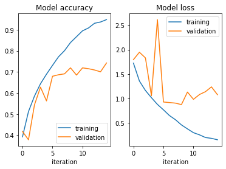
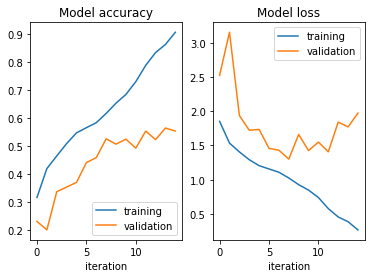

<a href="https://colab.research.google.com/github/nikomadol/ResNet50-on-CIFAR-10-and-FER-2013/blob/main/MyResNet50.ipynb" target="_parent"></a>

## Residual Networks

### Imports


```python
import numpy as np
from keras.layers import Input, Add, Dense, Activation, ZeroPadding2D
from keras.layers import BatchNormalization, Flatten, Conv2D, GlobalAveragePooling2D
from keras.models import Model
from keras.utils import to_categorical
import matplotlib.pyplot as plt
%matplotlib inline
```

### Identity Block

When the input has the same dimension as the output.


**First component of main path:**
- CONV2D
  - $F_1$ filters of shape (1,1)
  - Stride of (1,1)
  - Same padding
- Batch Norm on channel
- ReLU Activation

**Second component of main path:**
- CONV2D
  - $F_2$ filters of shape (f,f)
  - Stride of (1,1)
  - Same padding
- Batch Norm on channel
- ReLU Activation

**Third component of main path:**
- CONV2D
  - $F_3$ filters of shape (1,1)
  - Stride of (1,1)
  - Same padding
- Batch Norm on channel

**Final step:**
- Add shortcut and input
- ReLU Activation


```python
def identity_block(X, filters, f):
  F1, F2, F3 = filters
  X_shortcut = X

  # First component of main path
  X = Conv2D(
      filters=F1,
      kernel_size=(1, 1),
      strides=(1, 1),
      padding='same'
  )(X)
  X = BatchNormalization()(X)
  X = Activation('relu')(X)

  # Second component of main path
  X = Conv2D(
      filters = F2,
      kernel_size = (f, f),
      strides = (1, 1),
      padding = 'same'
  )(X)
  X = BatchNormalization()(X)
  X = Activation('relu')(X)

  # Third component of main path
  X = Conv2D(
      filters=F3,
      kernel_size=(1, 1),
      strides=(1, 1),
      padding='same'
  )(X)
  X = BatchNormalization()(X)

  # Final step
  X = Add()([X, X_shortcut])
  X = Activation('relu')(X)

  return X
```

### Convolutional Block

When the input and output dimensions don't match up.


**First component of main path:**
- CONV2D
  - $F_1$ filters of shape (1,1)
  - Stride of (s,s)
  - Same padding
- Batch Norm on channel
- ReLU Activation

**Second component of main path:**
- CONV2D
  - $F_2$ filters of shape (f,f)
  - Stride of (1,1)
  - Same padding
- Batch Norm on channel
- ReLU Activation

**Third component of main path:**
- CONV2D
  - $F_2$ filters of shape (1,1)
  - Stride of (1,1)
  - Same padding
- Batch Norm on channel

**Shortcut path:**
- CONV2D
  - $F_3$ filters of shape (1,1)
  - Stride of (s,s)
  - Same padding
- Batch Norm on channel

**Final step:**
- Add shortcut and input
- ReLU Activation
    


```python
def convolutional_block(X, filters, f, s):
  F1, F2, F3 = filters
  X_shortcut = X

  ##### MAIN PATH #####
  # First component of main path
  X = Conv2D(
      filters=F1,
      kernel_size=(1, 1),
      strides=(s, s),
      padding='same'
  )(X)
  X = BatchNormalization()(X)
  X = Activation('relu')(X)

  # Second component of main path
  X = Conv2D(
      filters=F2,
      kernel_size=(f, f),
      strides=(1, 1),
      padding='same'
  )(X)
  X = BatchNormalization()(X)
  X = Activation('relu')(X)

  # Third component of main path
  X = Conv2D(
      filters=F3,
      kernel_size=(1, 1),
      strides=(1, 1),
      padding='same'
  )(X)
  X = BatchNormalization()(X)


  ##### SHORTCUT PATH #####
  X_shortcut = Conv2D(
      filters=F3,
      kernel_size=(1, 1),
      strides=(s, s),
      padding='same'
  )(X_shortcut)
  X_shortcut = BatchNormalization()(X_shortcut)


  # Final step
  X = Add()([X, X_shortcut])
  X = Activation('relu')(X)

  return X
```

### ResNet50 Model


- Zero padding (3,3)

- Stage 1:
  - CONV2D
    - "filters_array[0][0]" filters of shape (7,7)
    - Stride of (2,2)
    - Same padding
  - Batch Norm on channel
  - <s>Max pooling of window (3,3) and stride (2,2)</s>
  - ReLU Activation

- Stage 2:
  - Conv Block
    - 3 sets of filters "filters_array[0]"
    - filters of shape (3,3)
    - Stride of (1,1)
  - 2 * ID Block
    - 3 sets of filters "filters_array[0]"
    - filters of shape (3,3)

- Stage 3:
  - Conv Block
    - 3 sets of filters "filters_array[1]"
    - filters of shape (3,3)
    - Stride of (2,2)
  - 3 * ID Block
    - 3 sets of filters "filters_array[1]"
    - filters of shape (3,3)

- Stage 4:
  - Conv Block
    - 3 sets of filters "filters_array[2]"
    - filters of shape (3,3)
    - Stride of (2,2)
  - 5 * ID Block
    - 3 sets of filters "filters_array[2]"
    - filters of shape (3,3)

- Stage 5:
  - Conv Block
    - 3 sets of filters "filters_array[3]"
    - filters of shape (3,3)
    - Stride of (2,2)
  - 2 * ID Block
    - 3 sets of filters "filters_array[3]"
    - filters of shape (3,3)

- Global Average Pooling2D

- Flatten

- The Fully Connected (Dense) layer using softmax activation


```python
def get_model(input_shape, classes, filters):
  """
  ZEROPAD
  Stage1: CONV2D -> BATCHNORM -> RELU -> MAXPOOL
  Stage2: CONVBLOCK -> IDBLOCK*2
  Stage3: CONVBLOCK -> IDBLOCK*3
  Stage4: CONVBLOCK -> IDBLOCK*5
  Stage5: CONVBLOCK -> IDBLOCK*2
  AVGPOOL -> FLATTEN -> FC
  """
  X_input = Input(input_shape)

  # ZEROPAD
  X = ZeroPadding2D((3, 3))(X_input)

  # Stage 1
  X = Conv2D(
      filters=filters[0][0],
      kernel_size=(7, 7),
      strides=(2, 2),
      padding='same'
  )(X)
  X = BatchNormalization()(X)
  X = Activation('relu')(X)
  # X = MaxPooling2D((3, 3), strides=(2, 2))(X)

  # Stage 2
  X = convolutional_block(X, filters[0], f=3, s=1)
  for _ in range(2):
    X = identity_block(X, filters[0], f=3)

  # Stage 3
  X = convolutional_block(X, filters[1], f=3, s=2)
  for _ in range(3):
    X = identity_block(X, filters[1], f=3)

  # Stage 4
  X = convolutional_block(X, filters[2], f=3, s=2)
  for _ in range(5):
    X = identity_block(X, filters[2], f=3)

  # Stage 5
  X = convolutional_block(X, filters[3], f=3, s=2)
  for _ in range(2):
    X = identity_block(X, filters[3], f=3)

  # AVGPOOL
  X = GlobalAveragePooling2D()(X)

  # Output Layer
  X = Flatten()(X)
  X = Dense(units=classes, activation='softmax')(X)

  # Create model
  model = Model(inputs=X_input, outputs=X, name='ResNet50')

  return model
```

## Train on CIFAR-10


```python
from keras.datasets import cifar10

(X_train_orig, Y_train_orig), (X_test_orig, Y_test_orig) = cifar10.load_data()
X_train = X_train_orig / 255
X_test = X_test_orig / 255

Y_train = Y_train_orig.flatten()
Y_train = to_categorical(Y_train)
Y_test = Y_test_orig.flatten()
Y_test = to_categorical(Y_test)
```

    Downloading data from https://www.cs.toronto.edu/~kriz/cifar-10-python.tar.gz
    170500096/170498071 [==============================] - 4s 0us/step
    


```python
CLASSES = Y_train.shape[1]
WIDTH = X_train.shape[1]
HEIGHT = X_train.shape[2]
CHANNEL = X_train.shape[3]
```


```python
filters_array = [
    [32, 32, 128],
    [64, 64, 256],
    [128, 128, 512],
    [256, 256, 1024]
]

model = get_model((WIDTH, HEIGHT, CHANNEL), CLASSES, filters_array)

model.compile(
    optimizer='adam',
    loss='categorical_crossentropy',
    metrics=['accuracy']
)

history = model.fit(
    X_train,
    Y_train,
    epochs=15,
    validation_split=0.2
)
```

    Epoch 1/15
    1250/1250 [==============================] - 45s 32ms/step - loss: 2.0386 - accuracy: 0.3196 - val_loss: 1.7949 - val_accuracy: 0.4178
    Epoch 2/15
    1250/1250 [==============================] - 39s 31ms/step - loss: 1.3883 - accuracy: 0.4995 - val_loss: 1.9463 - val_accuracy: 0.3783
    Epoch 3/15
    1250/1250 [==============================] - 40s 32ms/step - loss: 1.1946 - accuracy: 0.5770 - val_loss: 1.8306 - val_accuracy: 0.5440
    Epoch 4/15
    1250/1250 [==============================] - 40s 32ms/step - loss: 1.0297 - accuracy: 0.6383 - val_loss: 1.0538 - val_accuracy: 0.6278
    Epoch 5/15
    1250/1250 [==============================] - 40s 32ms/step - loss: 0.8656 - accuracy: 0.6933 - val_loss: 2.6145 - val_accuracy: 0.5626
    Epoch 6/15
    1250/1250 [==============================] - 41s 32ms/step - loss: 0.7580 - accuracy: 0.7349 - val_loss: 0.9270 - val_accuracy: 0.6795
    Epoch 7/15
    1250/1250 [==============================] - 40s 32ms/step - loss: 0.6385 - accuracy: 0.7771 - val_loss: 0.9161 - val_accuracy: 0.6866
    Epoch 8/15
    1250/1250 [==============================] - 40s 32ms/step - loss: 0.5457 - accuracy: 0.8086 - val_loss: 0.9043 - val_accuracy: 0.6909
    Epoch 9/15
    1250/1250 [==============================] - 40s 32ms/step - loss: 0.4224 - accuracy: 0.8521 - val_loss: 0.8740 - val_accuracy: 0.7195
    Epoch 10/15
    1250/1250 [==============================] - 40s 32ms/step - loss: 0.3461 - accuracy: 0.8792 - val_loss: 1.1311 - val_accuracy: 0.6850
    Epoch 11/15
    1250/1250 [==============================] - 41s 33ms/step - loss: 0.2686 - accuracy: 0.9061 - val_loss: 0.9820 - val_accuracy: 0.7193
    Epoch 12/15
    1250/1250 [==============================] - 41s 33ms/step - loss: 0.2223 - accuracy: 0.9210 - val_loss: 1.0800 - val_accuracy: 0.7153
    Epoch 13/15
    1250/1250 [==============================] - 40s 32ms/step - loss: 0.1831 - accuracy: 0.9366 - val_loss: 1.1389 - val_accuracy: 0.7092
    Epoch 14/15
    1250/1250 [==============================] - 40s 32ms/step - loss: 0.1563 - accuracy: 0.9462 - val_loss: 1.2371 - val_accuracy: 0.7006
    Epoch 15/15
    1250/1250 [==============================] - 40s 32ms/step - loss: 0.1292 - accuracy: 0.9565 - val_loss: 1.0765 - val_accuracy: 0.7426
    


```python
fig, (ax1, ax2) = plt.subplots(1, 2)

ax1.plot(history.history['accuracy'])
ax1.plot(history.history['val_accuracy'])
ax1.set_title('Model accuracy')
ax1.set_xlabel('iteration')
ax1.legend(['training', 'validation'], loc='lower right')

ax2.plot(history.history['loss'])
ax2.plot(history.history['val_loss'])
ax2.set_title('Model loss')
ax2.set_xlabel('iteration')
ax2.legend(['training', 'validation'], loc='upper right')
```


    <matplotlib.legend.Legend at 0x7f81d1c34090>


    

    


```python
score = model.evaluate(X_test, Y_test)
print("Loss = " + str(score[0]))
print("Test Accuracy = " + str(score[1]))
```

    313/313 [==============================] - 4s 11ms/step - loss: 1.1338 - accuracy: 0.7277
    Loss = 1.1338281631469727
    Test Accuracy = 0.7276999950408936
    

## Train on FER-2013


```python
from pydrive.auth import GoogleAuth
from pydrive.drive import GoogleDrive
from google.colab import auth
from oauth2client.client import GoogleCredentials
import pandas as pd
import math
```


```python
# Using PyDrive to read FER-2013 csv file from Google drive
!pip install -U -q PyDrive

# Authenticate and create the PyDrive client.
auth.authenticate_user()
gauth = GoogleAuth()
gauth.credentials = GoogleCredentials.get_application_default()
drive = GoogleDrive(gauth)

link = 'https://drive.google.com/open?id=14PtUEhxalkq74AsKEqpWOKTpH77qR2Jp'
_, id = link.split('=')

downloaded = drive.CreateFile({'id':id}) 
downloaded.GetContentFile('fer2013.csv')  

dataset = pd.read_csv('fer2013.csv').to_numpy()
np.random.shuffle(dataset)
```


```python
# Extract dataset images and labels 
dataset_images_dim = 48

dataset_images = np.empty((len(dataset), dataset_images_dim, dataset_images_dim), dtype='uint8')
dataset_labels = np.empty(len(dataset), dtype='uint8')

counter = 0
for data_row in dataset[1:]:
    emotion, img_data, _ = data_row
    img_str_array = img_data.split(" ")

    img_array = []
    for i in range(dataset_images_dim):
      image_row = []
      for j in range(dataset_images_dim):
        image_row.append(int(img_str_array[i * dataset_images_dim + j]))
      img_array.append(image_row)

    dataset_images[counter] = img_array
    dataset_labels[counter] = int(emotion)
    counter += 1
# change labels scale to one hot
dataset_labels = to_categorical(dataset_labels)
num_classes = dataset_labels.shape[1]

# reshape train data to prepare to fit into the model
dataset_images = dataset_images.reshape([dataset_images.shape[0], dataset_images.shape[1], dataset_images.shape[2], 1])
```


```python
# Split train and test data and labels
train_data_percent = 85
train_data_count = math.floor(len(dataset) * train_data_percent / 100)

X_train = dataset_images[:train_data_count] / 255
Y_train = dataset_labels[:train_data_count]

X_test = dataset_images[train_data_count:] / 255
Y_test = dataset_labels[train_data_count:]
```


```python
CLASSES = Y_train.shape[1]
WIDTH = X_train.shape[1]
HEIGHT = X_train.shape[2]
CHANNEL = X_train.shape[3]
```


```python
filters_array = [
    [64, 64, 256],
    [128, 128, 512],
    [256, 256, 1024],
    [512, 512, 2048]
]

model = get_model((WIDTH, HEIGHT, CHANNEL), CLASSES, filters_array)

model.compile(
    optimizer='adam',
    loss='categorical_crossentropy',
    metrics=['accuracy']
)

history = model.fit(
    X_train,
    Y_train,
    epochs=15,
    validation_split=0.15
)
```

    Epoch 1/15
    811/811 [==============================] - 89s 104ms/step - loss: 2.0978 - accuracy: 0.2694 - val_loss: 2.5242 - val_accuracy: 0.2323
    Epoch 2/15
    811/811 [==============================] - 86s 106ms/step - loss: 1.5720 - accuracy: 0.4055 - val_loss: 3.1522 - val_accuracy: 0.2019
    Epoch 3/15
    811/811 [==============================] - 87s 107ms/step - loss: 1.4380 - accuracy: 0.4586 - val_loss: 1.9375 - val_accuracy: 0.3383
    Epoch 4/15
    811/811 [==============================] - 88s 108ms/step - loss: 1.2865 - accuracy: 0.5145 - val_loss: 1.7217 - val_accuracy: 0.3547
    Epoch 5/15
    811/811 [==============================] - 88s 108ms/step - loss: 1.2004 - accuracy: 0.5525 - val_loss: 1.7337 - val_accuracy: 0.3715
    Epoch 6/15
    811/811 [==============================] - 88s 108ms/step - loss: 1.1401 - accuracy: 0.5720 - val_loss: 1.4574 - val_accuracy: 0.4421
    Epoch 7/15
    811/811 [==============================] - 88s 108ms/step - loss: 1.1202 - accuracy: 0.5814 - val_loss: 1.4304 - val_accuracy: 0.4598
    Epoch 8/15
    811/811 [==============================] - 87s 108ms/step - loss: 1.0021 - accuracy: 0.6262 - val_loss: 1.3005 - val_accuracy: 0.5269
    Epoch 9/15
    811/811 [==============================] - 87s 108ms/step - loss: 0.8836 - accuracy: 0.6703 - val_loss: 1.6601 - val_accuracy: 0.5079
    Epoch 10/15
    811/811 [==============================] - 88s 108ms/step - loss: 0.8314 - accuracy: 0.6935 - val_loss: 1.4247 - val_accuracy: 0.5256
    Epoch 11/15
    811/811 [==============================] - 87s 108ms/step - loss: 0.7562 - accuracy: 0.7264 - val_loss: 1.5487 - val_accuracy: 0.4937
    Epoch 12/15
    811/811 [==============================] - 87s 108ms/step - loss: 0.5385 - accuracy: 0.8050 - val_loss: 1.4067 - val_accuracy: 0.5544
    Epoch 13/15
    811/811 [==============================] - 87s 108ms/step - loss: 0.4102 - accuracy: 0.8536 - val_loss: 1.8409 - val_accuracy: 0.5240
    Epoch 14/15
    811/811 [==============================] - 88s 108ms/step - loss: 0.4024 - accuracy: 0.8603 - val_loss: 1.7703 - val_accuracy: 0.5653
    Epoch 15/15
    811/811 [==============================] - 87s 107ms/step - loss: 0.2345 - accuracy: 0.9184 - val_loss: 1.9724 - val_accuracy: 0.5546
    


```python
fig, (ax1, ax2) = plt.subplots(1, 2)

ax1.plot(history.history['accuracy'])
ax1.plot(history.history['val_accuracy'])
ax1.set_title('Model accuracy')
ax1.set_xlabel('iteration')
ax1.legend(['training', 'validation'], loc='lower right')

ax2.plot(history.history['loss'])
ax2.plot(history.history['val_loss'])
ax2.set_title('Model loss')
ax2.set_xlabel('iteration')
ax2.legend(['training', 'validation'], loc='upper right')
```


    <matplotlib.legend.Legend at 0x7f81c667d550>


    

    


```python
score = model.evaluate(X_test, Y_test)
print("Loss = " + str(score[0]))
print("Test Accuracy = " + str(score[1]))
```

    169/169 [==============================] - 6s 29ms/step - loss: 1.9666 - accuracy: 0.5557
    Loss = 1.966624140739441
    Test Accuracy = 0.5557206273078918
    
